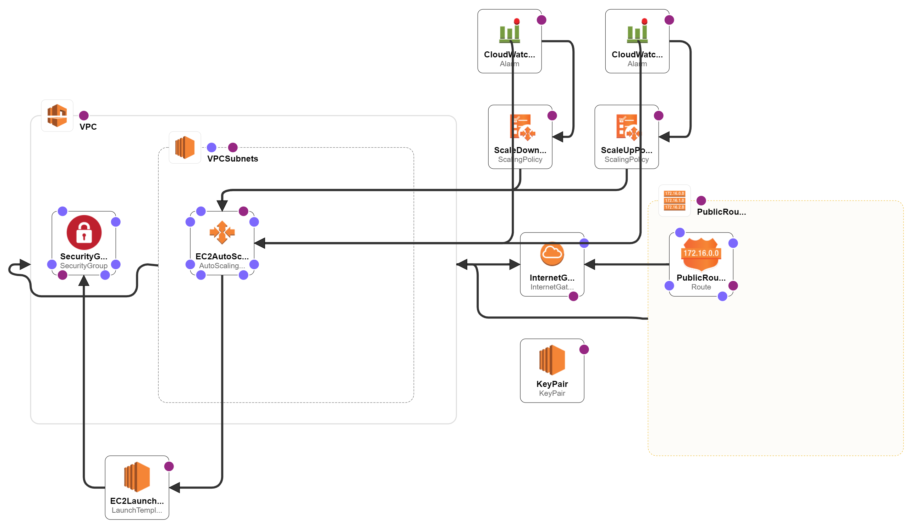

# **Scaling the EC2 Instance Based on Monitored CloudWatch Metrics**

### **Course-end Project 3**

**Description:** Use Auto Scaling to manage the EC2 instances and use EC2 instance and capture the metrics in the CloudWatch.

**Tools required:** AWS Services - CloudWatch, Auto Scaling, EC2

#### Solved in two ways:

AWS Console            |  CloudFormation
:-------------------------:|:-------------------------:
  |  
## Mentor

**Ritesh Behal**

## AWS Resources
- AWS CloudWatch Alarm
- EC2 Auto Scaling
- EC2 Templates

 

## References
- AWS CloudWatch Alarm documentation: https://docs.aws.amazon.com/AmazonCloudWatch/latest/monitoring/AlarmThatSendsEmail.html

- AWS EC2 Auto Scaling documentation: https://aws.amazon.com/ec2/autoscaling/

- AWS EC2 Templates documentation: https://docs.aws.amazon.com/autoscaling/ec2/userguide/launch-templates.html

## Diagram

## Authors

- [@sky9262](https://www.github.com/sky9262)

## 🔗 Connect with me

